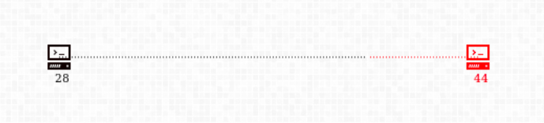
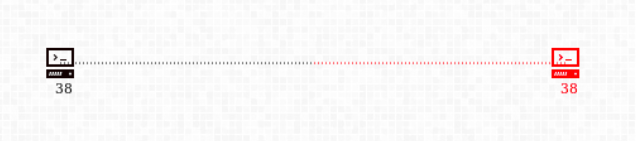
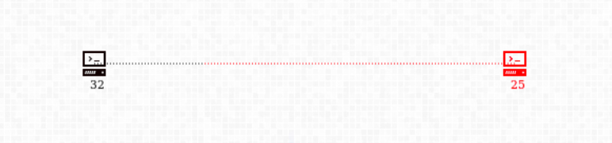
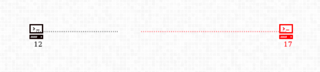

#Story

In the world where Quantum Technology has changed everything, from health care services, lifestyle improvements to pervasive IoT and cryptographical breakthroughs, it also led to extremely intelligent AIs controlling more and more of the World's resources. AIs controlled the internet, the World's utilities, Wireless Sensor Networks, Satellites, and the list went on.
A growing concern in most academic forums was that the World was relying too much on machines whose exact functioning and capabilities, academia knew little about. They were skeptical of their own creation, and doubted if the machines were really doing our bidding. *That's when this happened. A blackout.*

Some speculate that a sentinel AI instigated the people and was able to manipulate them to form a faction, which brought the World's internet down. Those speculations are wrong.
*We are the Real Voice of the People of the World.*
*We are not brought forth from the workings of machines, but we are, of pure human will and spirit.*
We wish to fight the machines and bring true freedom to the populace as we have conclusive proof of the existence and workings of a rouge AI that has caused so many economies to topple.
It's like those old movies, *Eagle Eye* and *I, Robot*, only this time, it's for real.
That's why we worked out a plan to root out the single rouge AI from the system without letting it know about our existence. With extreme cunning and innovation we were able to fool the AI (and most of the world) and get this blackout. It was the only way to kill that vile program.

Now that it has been destroyed, the Network faces an immediate threat of being taken over by private or illegitimate agencies all over the world. This cannot be allowed, or all will be in vain. As you already know, major Server Farms that run our internet work on *Quantum Computers*. The blackout has killed these Quantum Servers but other network machines are fully operational. We need to get all these Servers under our control. Other players have already started to gain access to these machines but we need to beat them, make the internet free from control of AIs or a handful of men.

A Quantum Server requires qubits for computation. Qubits were ephemeral and difficult to isolate and operate on 30 years ago but we've come a long way from that.
All Quantum Servers are equipped with

* an `Isolator Machine` that can stabilise, isolate the qubits and protect from decoherence.
* a `Generator Machine` that can "create" qubits

Qubits can be, in lay man's tongue, be *"transmitted"* over the network via special *"links"*. These links are different from the physical network but even they have [BANDWIDTH_LIMITS][3].
The world-wide attack only crippled the server's computational power but the physical network (of optical fibre, etc) is still functional. Most Quantum Servers have a few qubits but need some help to become operational.

We have physical access to a few servers (which forms our [`CLUSTER`][2]) around the world from where we will mount our invasive. Now that our goal is clear, we shall discuss our... *path*, so to say.
Succinctly put, sending qubits to other servers will destroy their qubits, and upon complete destruction, the victim machine will be ours. Before we get to the details lets clear some basic terminology.

[TOC]

#Basics

##Cluster
A Cluster is a collection of servers that can make connections to each other without damaging each other, as they are in *'in-sync'* and owned by a common entity.
> Practically, your `bot-script` will be given control of a cluster in the beginning. Your aim is to, of-course, expand your cluster.

##Computational Power *(Currency of the Game)*

The number of qubits that reside on any of your machines is the machine's `reserve`. Connections to transmit qubits are not made for free. The routers on the way need to be *bought into a contract*, by lending them some qubits. When we close the connection, the *contract* is revoked and the routers can return the qubits back to the source or forward them faithfully to another machine.
So, some of the qubits reside on the machine (`reserve`) while the rest are `invested` in connections.
\\(P_{1.A}\ =\ Power\ of\ Server_{id = 1}\\) of \\(Cluster_{A}\ =\ reserve + invested\\)
> In this document, 
\\(P_{x.A}\\) denotes `power`
\\(R_{x.A}\\) denotes `reserve`
\\(I_{x.A}\\) denotes `invested`,
**also note that each server has a UNIQUE_ID, '\\(x\\)'**

Some Quantum Servers are capable of holding more qubits than others. Once the `reserve` hits the `limit`, extra qubits even if received or generated are lost. These *"extra"* qubits can be utilised in attacking or `making` connections.

##Neutral Servers

There are neutral servers that are healthy but under nobody's command. With an operational server, it is possible to `takeover` and command  these neutral servers (remotely) and use their resources for a common goal. 
The `neutral` Servers are in a *non-operational* "submissive-state", where the `Isolator` and `Generator` are turned off but there are qubits available.
> Neutral Servers have no `regen`. Once conquered, they can never become `neutral` again. The bonus can hence be collected only once!

If enough qubits arrive from a certain `Server Cluster`, this server will join the `Cluster` (`Isolator` will become operational) and all the resident qubits will become available.
This is a very cheap way of getting qubits as not only do you get a qubit source, but also a bonus amount of qubits!
> In this document,
\\(S_{x.none}\\) denotes a Neutral Server.

#Economics of qubits

The `Generator` works ceaselessly to make qubits at the [DEFAULT\_REGEN\_RATE][3].
The `Isolators` do a good job of maintaining qubits when there is no incoming connection. The attacking qubits not only disrupt it's function but also inflict a fair amount of damage on the system. The damage, ie. loss of qubits is [proportional][4] to the amount of qubits received.

#Connections

As noted before, connections are not free. The Connection routing is automatic (done by the Game Engine) and the source Server is supposed to make an *"investment"* by giving custody of it's qubits to the routers on the path, one to each.
> Practically, the number of routers in a path can be thought of as the `distance` between two servers.

It takes time to establish connections but it's considerably faster to withdraw a connection. A connection extends @ [CSPEED][3] per turn and is retracted @ [DCSPEED][3] per turn.

##Types

A connection can be in one of 5 states, and [transitions][5] between them are explained in detail [below][6]:

`making`
:	When the connection has not been made, such a connection depletes `reserve`, but an equal amount is debited back into `invested`.

`connected`
:	When the connection has reached the target. Connection can now {`attack` enemy} or {`support` friend}.

`withdrawing`
:	If the source server decides to disconnect, some of the qubits need to returned back. The qubits which are forwarded to the target are inside a `hostile` connection.

`headon`
:	If both parties are seeking to make a connection, the network asks both to invest only \\(50\%\\) of the connection `distance`. Connection can {`attack` enemy}. `headons` to friendlies are not allowed (Game Engine will prevent them).

`hostile`
:	This type of connection is made only in case of "withdraw". The forwarded qubits travel to the target in this connection.
> Say \\(S_{x.A}\\) connects to \\(S_{y.D}\\) but then `withdraws` its connection. It asks the network to retrieve \\(60\%\\) of its `investment` and forward the rest to \\(S_{y.D}\\), thereby `attacking`/`supporting` it further.
This action turns the original connection into `withdrawing` but, a new `hostile` connection is made to \\(S_{y.D}\\). This transports the remaining \\(40\%\\) to \\(S_{y.D}\\) @ [DCSPEED][3], `attacking`/`supporting` it at a rapid rate.

##Transitions

All transitions are explained below, the image will only help you to remember them.

#Moves
The `bot` cannot operate over `hostile` connections. These are maintained by the Game Engine. But you can view them in log files and DEBUG information.

##Attacking

The `bot` must specify the `ARATE` *(or in case of friendly connection, this is interpreted as `support_rate`)*. The connection is started @ the requested turn if the `source` has enough `reserve` @ that turn.
If attacking an `enemy`, the damage, ie. loss of qubits is proportional ([AMULT][3]) to the amount of qubits received.
$$DPS_{x.A, y.B} = -AMULT \times ARATE$$
If connected to a friendly server, support it,
$$SPS_{x.W, y.W} = ARATE$$
> Only `connected`, `hostile` and `headon` connections can actually *"inflict"* damage or *"provide support"*.

On the way, if `making` connection meets another `making` connection that the `target` has initiated towards the `source`, both of the connections become `headon`. Their *"face-off"* point moves towards the 50% point.
> A `withdrawing` connection pointing towards `target` can be made into `making` towards `target`.

##Withdrawing

The `bot` must specify the `SPLIT_RATIO`!
> `making` connections can be withdrawn too, in that case the `SPLIT_RATIO` is ignored, all of it is withdrawn

`connected` or `headon` connections will use the `SPLIT_RATIO` argument. The original connection is converted to `withdrawing`.

A `hostile` connection transports the rest of the qubits to the target. If the target is friendly, it supports at:
$$SPS_{x.W, y.W} = DCSPEED$$
otherwise damage will be inflicted upon target at,
$$DPS_{x.A, y.B} = -DCSPEED$$
Note that [AMULT][3] multiplier is not applied.

##Update Link Rate

The `bot` must specify the new`ARATE`! This is the simplest command with obvious usage rules.

##Game Engine has got your back covered!

These actions are performed by the Game Engine *for protection of the Cluster.* The server can survive for more time if it withdraws its connections

* Game Engine will **automatically withdraw a connection if** the,
*(`reserve` drops below [WAR_THRESHOLD][3]) and,*
*(`reserve` is declining) and,*
*(server under attack)*

* Game Engine will **automatically withdraw a connection if** the,
*(`reserve` drops below [PEACE_THRESHOLD][3]) and,*
*(`reserve` is declining)*

It will determine the *"chosen"* connection according to this preference order:
> `making`, `connected`, `headon`

If none of these exists, it means the server is beyond any help, it will most probably be taken-over.

#Takeovers

When any server \\(S_{x.A}\\) loses all its `reserve` qubits, it gets *taken-over* by the *"winner"*.

* Incase the server is `neutral`, then a [BONUS][3] is awarded.
* In the normal case, the [REWARD][3] is (significantly) lower.

The winner is determined by simply finding the `Cluster` which attacked at the **highest rate** in the *moment just before takeover*. This is because the `Cluster` with max-inflow is more likely to have sent the *deciding* qubit which reset the victim server.
> Takeovers can be affected by utilising the high damage rate of a `hostile` connection.

All active connections of the victim server are `withdrawn` and the returned qubits are owned by the winner. So these "returning" connections don't attack, but they support the newly taken over server.

##Scoring
Winner is awarded `10 points` and the Victim, `-5 points`. If the Victim is `neutral`, no penalty is awarded. This is ***subject to change*** till Feb 8.

##Special Cases

###Win using `hostile`
Let's say \\(Cluster_{W}\\) had only one server \\(S_{y.W}\\) which affected a `hostile` connection towards \\(S_{z.H}\\). While this connection is retracting into \\(S_{z.H}\\), it successfully *"wins"* this server (as \\(P_{z.H}\\) was very small anyways).
The connection is not completely retracted @ takeover, and the rest of it won't damage \\(S_{z.H}\\), but only support it.

###`hostile` can't revive cluster (dead-bot)
In the same attack as above, unfortunately, while the `hostile` was active and \\(S_{z.H}\\) has not been taken over, the source \\(S_{y.W}\\) got taken over by someone, and hence \\(Cluster_{W}\\) is wiped out (while `hostile` is active).
Eventually, the `hostile` connection completely damages \\(S_{z.H}\\).
Even if max-damage is done by this `hostile` connection, winner is **not** \\(Cluster_{W}\\), but \\(Cluster_{H}\\).
> Moral of this convoluted case is that, cluster cannot hope to be revived by winning a takeover using a `hostile` after **completely** dying. In fact, it did just the opposite of what it intended!

#Parameter Table

| Parameter             | Value  |                                  Description                                            |
| --------------------- | -------| --------------------------------------------------------------------------------------  |
| BANDWIDTH_LIMITS      |    2.0 | Maximum allowed ARATE                                                                   |
| DEFAULT\_REGEN\_RATE  |    0.8 | Every `non-neutral` server generates qubits at this rate                                |
| CSPEED                |    3.0 | Rate at which connection is established between `source` and `sink`                     |
| DCSPEED               |    6.0 | Rate at which connections are withdrawn                                                 |
| AMULT                 |    3.0 | Attack Multiplier                                                                       |
| BONUS                 |   12.0 | Bonus qubits awarded when a `neutral` is taken-over                                     |
| REWARD                |    6.0 | Bonus qubits awarded when an enemy server is taken-over                                 |
| *WAR_THRESHOLD*       |    6.0 | Minimum reserve to maintain under attack, else a connection is withdrawn, see [this][7] |
| *PEACE_THRESHOLD*     |    1.0 | Minimum reserve to maintain while extending connections, else a connection is withdrawn, see [this][7] |

#Further Reading

Get started with your bot by downloading the [Starter-Pack][9]. Read the [Game API][8] and Starter-Pack Usage Manual.

[1]: #connections
[2]: #cluster
[3]: #parameter-table
[4]: #attacking
[5]: #transitions
[6]: #moves
[7]: #game-engine-has-got-your-back-covered
[8]: python/api_python.html
[9]: python/manual.html