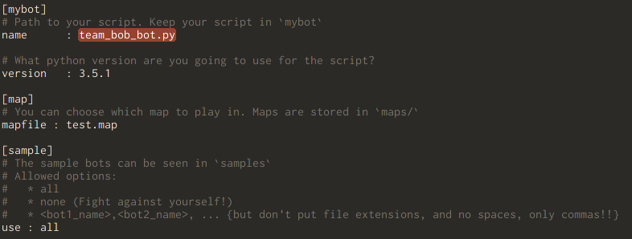
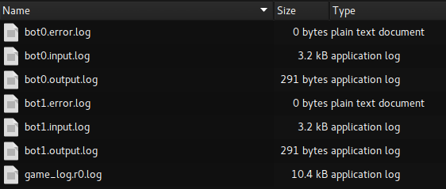

#User Manual

This document contains instructions and tips in using the StarterPacks. For Game Specification head over [here][2].
See the [walkthrough][1] for a guided tour of the features and usage of the StarterPack.

Choose your preffered language : `Python` `C` `C++`

> We are extremely sorry that the `C` and `C++` starter packs are not ready yet. They should be deployed by the end of this week (Jan 30). In the meantime, if you know a bit of python you can atleast get familiar with the game, take your bot for a spin. Download the pack and unpack into any folder.

##Download the Pack

The `Full` tar contains everything and after downloading all you have to do is unpack the archive.
(Only) The actual executable is in `Engine` tar.
`maps/`, `samples/` (bots) are in `utilities` tar.

We will be updating `utilities` often so there's no need for you to download the `Full` tar each time.
**Any changes to the starter packs will feature on the [news](index.php#news).**
**The API or Game Specification is unlikely to change and hence your AI script would not require any change, even if the `Engine` is updated.**
**See the [changelog](bob16.pythonanywhere.com/media/changelog.txt).**


DOWNLOAD BUTTON
base address == https://goo.gl/ToXztS
###Unpacking

Most linuxes have GUI utilities for upacking `.tar.xz` by default. You can also do it on the command line, but don't forget to `cd` into the right directory.
```
$ unzip -u {tar-name}
```
You need to unpack the `utilities` tar *inside* the `Engine` or `Full` tar.

##Directory Structure

If your directory looks like this, you're good to go.

```
saber/
js/
logs/

maps/
mybot/
samples/
arena/

config.ini
launch.sh
```

* The path to the packaged executable *(which we call `saber`)* is `saber/saber`.
* `maps/` contains a few Scenarios that you can use for testing.
* `samples/` has a few sample bots (that are extremely dumb). You can pitch `mybot` against them.
* `mybot/` contains your AI script. Ignore the `Quantum.py` and `util.py`. You can read them, but you'll gain little useful information.
* `logs` will contain the comprehensive Game logs which you can use to squash those nasty bugs and comb out errors.
* `game-ui/` contains the visualisation of the game that you can launch by opening `game-ui/view-game.html` in your browser. You must enable `javascript`.
* `arena/` is not used *(as of now)*.

##Usage

Write your AI script in python *(3.X prefferably, though 2.7 is supported)* and save it in `mybot`.

###Configure the System

Edit `config.ini` and change the bot `name`, you can also specify the `map` you want to use.
You cannot *preview* the map. Run a game to see the map.
> Some maps have many participating bots!

  + Read the instructions in `config.ini` to correctly specify the bots you want play against.

<center></center>
> **Why do I need to specify the python version I'm using?**
A `python 3.5.1` interpreter is embedded in this starter pack. If you use version `3.X`, the inbuilt interpreter will run the script. Otherwise, you must have a working installation of python `2.7.X` on your machine.

###Launch a game

Fire up your terminal and navigate to the directory where you unpacked the starter-pack and invoke
```sh
$ bash ./launch.sh
```
That's it, you're done! You can see some of the ending Game-Statistics on the console.
The logs will have been dumped into `logs`.

##Visualising and Debugging

You can now visualise the game by opening `game-ui/view-game.html` in your browser. You must enable `javascript`.

If you see your bot act in an unexpected manner, view the input and output logs for your bot. By default, your script is dubbed as `bot0`. You can use any text-editor for opening the `.log` files *(they're just *`plain-text`*)*.
`game_log.rX.log` has complete game-state at each turn.

<center></center>

###Log File Format
`game_replay.*.log` and `error.log` are easily readable.

####Sample `input.log`
```
turn~0
##initialisation info
act_width~60.000000
aspect~1.777778
turntime~2
loadtime~2
bot_count~2
server_count~3
id~1
##'s' or 'n' == server
## server_id, position_x, position_y, reserve, invested, limit, owner_id
s~0 0.250000 0.400000 15.000000 0.000000 80.000000 0
s~1 0.750000 0.400000 40.000000 0.000000 80.000000 1
## neutral servers are held by owner (-1)
n~2 0.500000 0.800000 15.000000 0.000000 60.000000 -1
ready
##game has started
turn~1
## current bot score
score~0
## state of all servers
s~0 15.000000 0.000000 0
s~1 40.000000 0.000000 1
s~2 15.000000 0.000000 -1
go
turn~2
score~0
## state of all servers
cn~1 2 0.400000 20.180436
s~0 15.800000 0.000000 0
s~1 35.800000 5.000000 1
s~2 15.000000 0.000000 -1
## state of all "connections"
## source sink attack_rate current_length
c~1 2 0.400000 0 5.000000
go
```

####Sample `output.log`
```
# turn 1
## attack src->sink attack_rate
a 1 2 0.400000
# turn 2
# .
# .
# .
# turn 24
## update src->sink new_attack_rate
u 1 2 0.100000
# turn 25
# turn 26
## withdraw src->sink split_ratio
w 1 2 1.000000
# turn 27
```

###Submitting your AI Script

Login to your account on \<Asvarvaerv>bob<\aergserg> and navigate to the Submissions tab. Upload your `.py` file.

#Errors and Getting Help

You tried everything to fix the game on your side but you now suspect that the fault is in the Game Engine. Just send us a mail that describes the issue and attach a `.zip` or `.tarX` that includes,

* `logs/`
* `config.ini`

We'll get back to you with an explanation and if it really is a mistake on our side, we'll fix and redistribute the starter-pack.
Fixing the bugs is *unlikely* to change The API or Game Specification and hence it's *unlikely* that you'll have to edit your AI script.
So, we request you to stay tuned to the [news][4].

#Note

We have exposed a lot of the Game Engine by providing you with an executable. You can try editing it, or try to understand it but we can assure you nothing good will come of it. We will only take the file you have created in `mybot/` and use our local copy of the engine. Hence, your effort might be in vain. After the event is over, Game Engine source-code might be released. Sit tight till then! :D

[1]: walkthru.html
[2]: ../game_spec.html
[4]: ../index.php#news