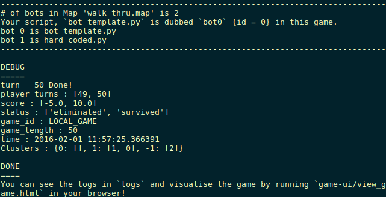
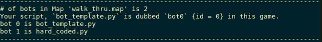
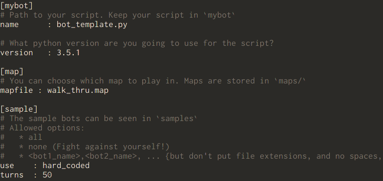

Quick Start
===========

This document is a Walk-through for the Python Starter Pack. It will guide you through the first time setup.
First download the `all_python-starter_pack`

asdfjkaksjdhnoaisdoighoasijdgoijas;doifjgo;iasdjfgiojdsfo;ijgisjdfg  DOWNLOAD BUTTON

Unpack the package anywhere on your machine.
Most Linuxes have GUI utilities for unpacking `.tar.xz` by default. You can also do it on the command line, but don't forget to `cd` into the right directory.

```
$ unzip -u {tar-name}
```

Fire up your terminal and type in these commands to launch a Game:

```bash
$ cd <unpack-directory-path>
$ bash ./launch.sh 
```
You should get something similar to the image below on your terminal. *This may change as the game engine is updated.*



Instead of us explaining what happened in the Game, how about you *see* the Game? Open a file explorer and go to the `game-ui` folder. Open `view-game.html` in your browser and lo, behold!

What did `launch.sh` do?
----------------------

See the contents of directory `mybots`. This directory will hold your AI script.
See the contents of directory `samples`. This directory holds `sample-AIs`.
Open `config.ini`. This file is read to configure the Game. This time it ran a Game in `test.map` with:



The `use` attribute under the Section `[Samples]` decides which sample bots are used to populate other clusters.
`turns` decides the duration of the game.
For any clarifications, read the [Manual][2] and if that doesn't satisfy you, feel free to contact us.



Coming back to the output on the terminal, you can see the details about the bots used in the current map.
In the `DEBUG` section, you can see the Game State at the last turn of the match.

```
status: ['survived','eliminated']
```
> This means that `bot0` survived the match while `bot1` was eliminated at some point. Other possibilities are `{'timeout', 'crashed'}`

```
game_length : 100
```
> No. of turns in this match.

```
score : [0,0]
```
> Points earned by the bots. See [Point System][4]

```
player_turns : [100, 58]
```
> No of turns each player lasted.

Make Your Bot better
--------------------

Lets do something about our bot, it does absolutely nothing right now. Just sits there waiting to be gobbled up.
First of all, change the file name to something cool, say, `blazing-knight.py`.
Open this file in your text editor and make these changes:

```py
	def do_turn(self, game):
		if game.turn == 1:
		 	game.attack(0, 2, 2)
		if game.turn == 15:
			game.attack(2, 1, 0.8)
			game.update_link(0, 2, 1.5)
```

Try running a game now, your bot would now attack a `neutral-server` @turn 15. Eventually, your bot (black) will win!
Read the [Game API][1] to know how exactly to command your bot and how to utilise the variable `game`.

Configure
---------

Edit the config.ini file to set your AI script `blazing-knight.py` (that you want to use in this game) to the `name` attribute.
Leave the python version and map as is.
Set `turns` to `50`
The `sample` section will play a big role in your bot's development as you can enter your bot in the arena against other sample bots.
The big bonus is that you can even edit the sample bots! So, theoretically, this pack does not hinder your bot development in any way (except availability of maps)! You cannot add new files, though. The `use` attribute only recognises the pre-registered file-names *(but does not check their contents)*.
If you wish to, you *can* run your bot against instances of itself by setting `use` to `none`! That should be an amusing sight in itself but could also be used by machine learning enthusiasts!
Refer [Configuring Game][3]

Next Steps
----------

These were the baby steps. Read the [Game Specification][5] and refer the [User Manual][2] and [Game API][1]

[1]: api_python.html
[2]: manual.php
[3]: manual.php#config
[4]: ../game_spec.html#scoring
[5]: ../game_spec.html